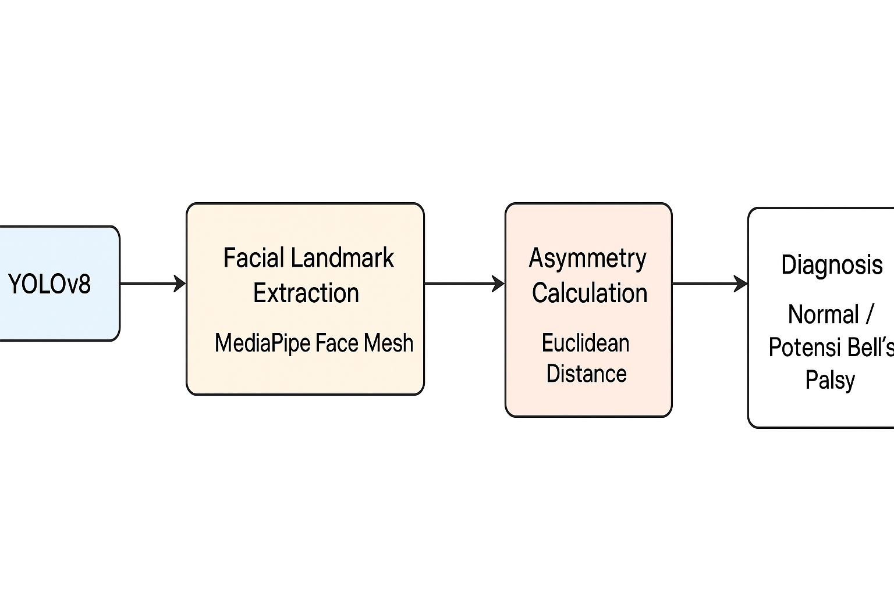
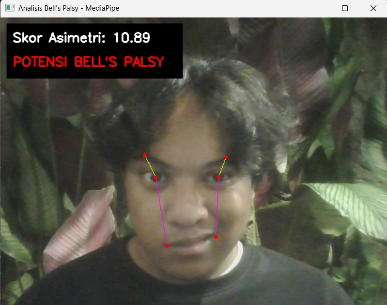

---

# Analisis Asimetri Wajah dengan Object Detection: Implementasi YOLOv8 untuk Identifikasi Bell’s Palsy


Sistem ini menggabungkan **YOLOv8** dan **MediaPipe FaceMesh** untuk melakukan analisis asimetri wajah secara *real-time* sebagai indikator awal kemungkinan **Bell’s Palsy**.

---

## 📐 Diagram Arsitektur Sistem

Diagram berikut menggambarkan alur proses dari deteksi wajah hingga klasifikasi tingkat asimetri:



---

## 📌 Fitur Utama

* **Deteksi Wajah (YOLOv8):** Menentukan area wajah secara tepat pada setiap frame.
* **Ekstraksi Landmark (MediaPipe):** Menghasilkan 468 titik landmark wajah untuk analisis geometri.
* **Perhitungan Asimetri:** Mengukur ketidakseimbangan struktur wajah menggunakan Euclidean Distance.
* **Analisis Real-time:** Menampilkan hasil dan skor langsung dari webcam.
* **Visualisasi Akurat:** Garis bantu dan bounding box untuk mempermudah interpretasi.

---

## 🛠️ Teknologi yang Digunakan

* Python 3.10
* Ultralytics YOLOv8
* MediaPipe Face Mesh
* OpenCV
* NumPy

---

## ⚙️ Instalasi

### 1. Membuat Environment

```bash
conda create -n bellpalsy python=3.10
conda activate bellpalsy
```

### 2. Instal Dependensi

```bash
pip install ultralytics mediapipe opencv-python numpy
```

### 3. Mengatur Path Model

Edit file `Code/main.py`:

```python
BEST_MODEL_PATH = r'C:\Users\NamaUser\...\bell_palsy_project\train_result_v12\weights\best.pt'
```

---

## 🚀 Cara Menjalankan

1. Hubungkan webcam.
2. Buka folder proyek (`Project_Akhir_Compvis`).
3. Jalankan program:

```bash
python Code/main.py
```

4. Indikator pada layar:

   * **Kotak hijau** → Deteksi wajah YOLO
   * **Garis kuning/ungu** → Pengukuran asimetri
   * **Skor** → Nilai tingkat asimetri

5. Tekan **q** untuk menutup aplikasi.

---

## 🧠 Cara Kerja Sistem

### 1. Deteksi Wajah — YOLOv8

Model mendeteksi keberadaan wajah dan memberikan bounding box sebagai acuan.

### 2. Ekstraksi Landmark — MediaPipe

FaceMesh memetakan ratusan titik wajah dan mengambil titik acuan:

* Mata kiri & kanan
* Alis kiri & kanan
* Sudut mulut

### 3. Perhitungan Asimetri

Menggunakan:

**Skor = (Selisih Alis + Selisih Mulut) / Jarak Antar Mata**

Normalisasi penting: sistem tetap stabil meski jarak wajah berubah.

### 4. Klasifikasi

* **Skor < 5.0 → SIMETRIS**
* **Skor ≥ 5.0 → POTENSI BELL’S PALSY**

---

## 📸 Contoh Hasil Deteksi

### Hasil Deteksi: Potensi Bell’s Palsy



---

### Hasil Deteksi: Simetris


---

## ⚠️ Disclaimer

Sistem ini digunakan untuk kebutuhan akademik dan **bukan** alat diagnosis medis.
Untuk evaluasi resmi, konsultasikan dengan dokter spesialis.

---

## 👨‍💻 Author

Mahasiswa Fakultas Ilmu Komputer – Universitas Brawijaya

1. **Barru Wira Yasa** (235150301111021)
2. **Muhammad Shean Elliora Ribah** (235150307111045)
3. **Rayhan Sulistyawan** (235150301111019)

---

